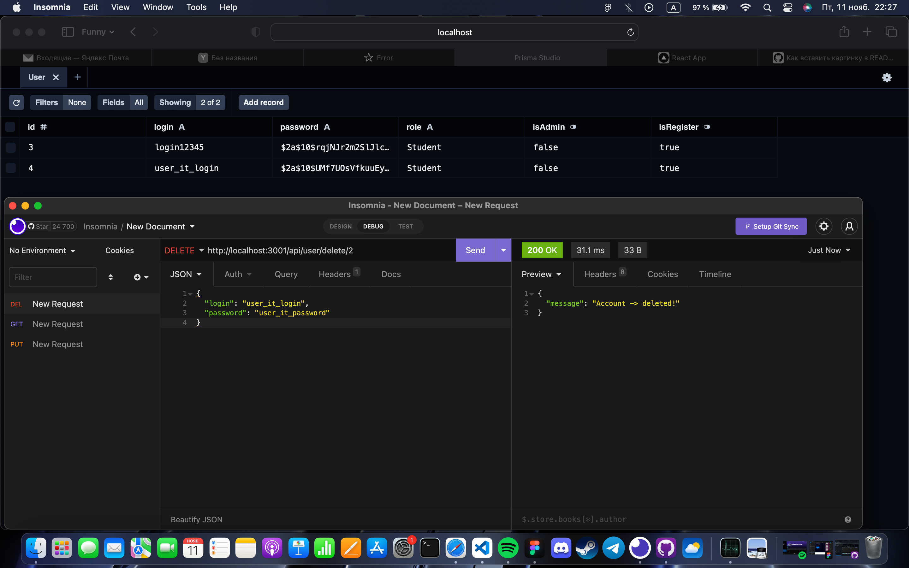

# testTasks-it-club

### Задачи:
- POST /api/user/ (создает пользователя)
- GET /api/user/ (вернет всех пользователей)
- GET /api/user/{id}/ (вернет пользователя по ID)
- PUT /api/user/{id}/ (изменение пользователя)
- DELETE /api/user/{id}/ (удаление пользователя)

---

### Технологии:
#### Server-side
- express.js
- bcrypt.js
- typescript
- nodemon
- Prisma ORM (prisma studio & sqlite db file)

#### Client-side: 
- React.js (typescript)
- axios

---
### Инструкция к запуску проекта:
- git clone from https://github.com/exodie/testTasks-it-club.git project
#### Server-side:
- run `cd server`
- run `npm i`
- run `npm run dev` (Откроется окно с Prisma Studio, в котором будут хранится данные; а также запустится локальный express сервер на 3001 порте)

#### Client-side:
- run `cd client`
- run `npm i`
- run `npm start`

### Prisma-scheme:
- rename `server/prisma-example` folder to `prisma`
- rename file in prisma folder to `schema.prisma`
- If you have error from prisma, delete all migrations & dev.db file and run `npx prisma migrate dev`

### .env:
- rename `server/.env.example` to `.env`
- input your port number (maybe 3001) like `EXPRESS_APP_PORT='3001'`

---
### Инструкция к использованию запросов:
#### Server-side - http://localhost:3001:
- /api/user/create - создает нового пользователя,
- /api/user/allUser - получаем на клиент (в консоль) всех пользователей в объекте,
- /api/user/get/:id - получаем на клиент всю информацию о пользователе (по его уник. id)
- /api/user/change/:id - изменяем статус админа с false на true (по уник. id)
- /api/user/delete/:id - удаляем пользователя из БД (по уник. id)

### Client-side - http://localhost:3000:
- http://localhost:3000/ - несколько доступных строк ввода данных, и несколько кнопок отвечающих за "функционал".

---
### Результаты запросов:
- создание пользователя: 

- Поиск всех пользователей: 

- Поиск по id: 

- Изменение по id: 

- Удаление пользователя по id: 
